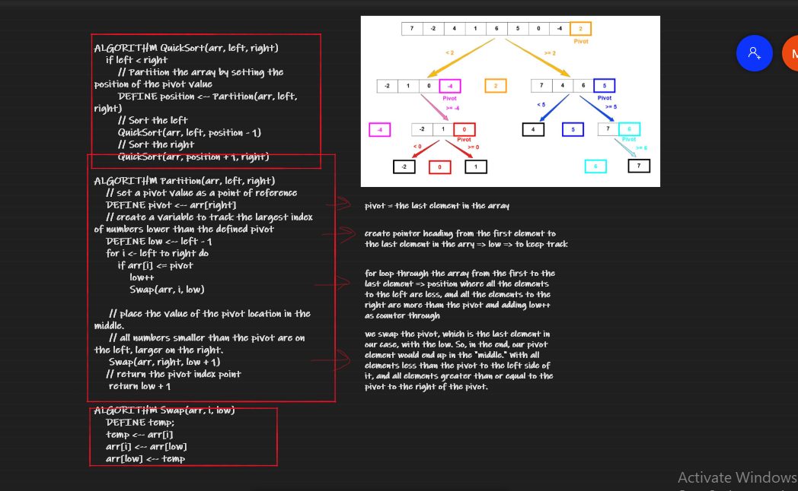

# Challenge Summary

Sorting refers to arranging items of a list in a specific order

## Whiteboard Process

<!-- taking the last element as povit -->

## Approach & Efficiency

1. First find the “pivot” element in the array.
2. Start the left pointer at first element of the array.
3. Start the right pointer at last element of the array.
4. Compare the element pointing with left pointer and if it is less than the pivot element, then move the left pointer to the right (add 1 to the left index). Continue this until left side element is greater than or equal to the pivot element.
5. Compare the element pointing with right pointer and if it is greater than the pivot element, then move the right pointer to the left (subtract 1 to the right index). Continue this until right side element is less than or equal to the pivot element.
6. Check if left pointer is less than or equal to right pointer, then swap the elements in locations of these pointers.
7. Increment the left pointer and decrement the right pointer.
8. If index of left pointer is still less than the index of the right pointer, then repeat the process; else return the index of the left pointer

