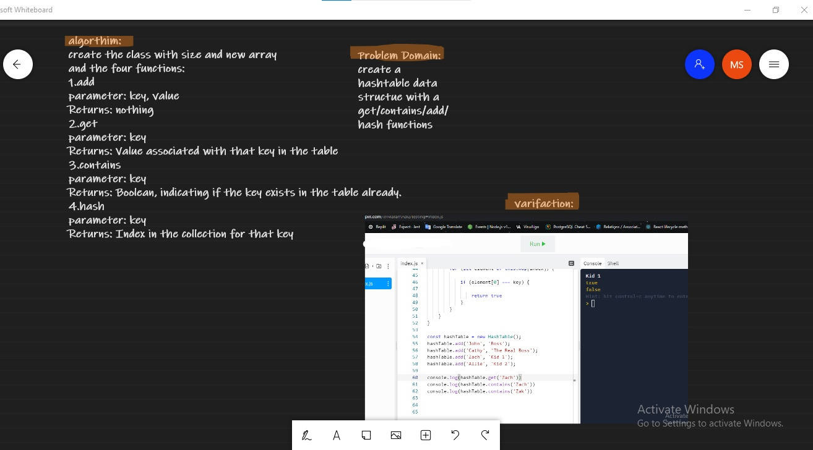

# Challenge Summary

create a hashtable data structue with a get/contains/add/hash functions

## Whiteboard Process

## Approach & Efficiency

create a hashTable class and method for each function
big(O) for space
get/contains-O(1)
add-O(1)
big(O) for time
get/contains-O(n)
add-O(1)